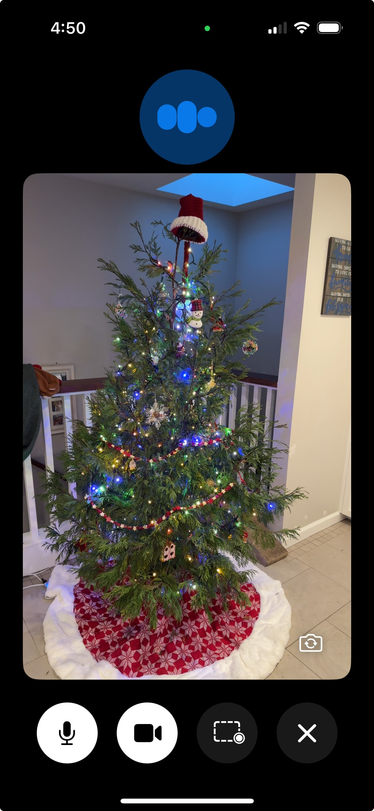

# LiveKit Vision Demo

This LiveKit example project demonstrates how to build a sophisticated AI agent that can process realtime video feed, similar to the ChatGPT advanced voice with video feature.

The project contains a native iOS frontend, built on LiveKit's [Swift SDK](https://github.com/livekit/client-sdk-swift), and a backend agent, built on LiveKit's [Python Agents framework](https://github.com/livekit/agents).



# Features

### Real-time Video & Audio
- 📱 Front and back camera support
- 🎙️ Natural voice conversations
- 🖥️ Live screen sharing

### Background Support
- 🔄 Continues running while using other apps
- 💬 Voice conversations in background
- 👀 Screen monitoring while multitasking

The assistant can observe and interact with you seamlessly, whether you're actively using the app or working on other tasks.


# Agent Architecture

The backend agent is built on the [VoicePipelineAgent](https://docs.livekit.io/agents/voice-agent/voice-pipeline/) class for core conversation AI support, but it includes some boundary-pushing modifications on top.

The primary modification is the use of a new class, `Conversation`, to track the conversation transcript and video feed over time. These entries are timestamped and can be converted to `ChatContext` before being sent to the LLM. By maintaining the video feed in this format, the `Conversation` class is able to dynamically resample and pack video frames to manage the LLM context window.

Currently, the conversation samples 2 frames per second while the user is speaking, and 0.5 frames per second otherwise. The most recent 10 seconds of video is always passed to the LLM at full-size, but older frames are packed together to reduce the context size.  Frames up to a minute old are packed into 2x2 grids, and frames older than that are packed into 4x4 grids.

The LLM in use is OpenAI's GPT-4o, and images are passed at 512x512 max size and given the "low" detail parameter for vision.

# Running Locally

This project is meant to be a starting point for your own project, and is easy to run locally.

## Running the Agent

### Prerequisites

- [LiveKit Cloud](https://cloud.livekit.io) project
- [OpenAI API Key](https://platform.openai.com/api-keys)
- [Cartesia API Key](https://cartesia.ai/api-keys)
- [Deepgram API Key](https://developers.deepgram.com/api-keys)
- Python 3

Or feel free to use your preferred TTS and STT provider by changing the plugin used in the `agent/vision_assistant.py` file. 

You can also easily modify this demo to use the the Claude family of models with LiveKit's Anthropic Plugin.

### Setup

Put your LIVEKIT_URL, LIVEKIT_API_KEY, LIVEKIT_API_SECRET, OPENAI_API_KEY, CARTESIA_API_KEY, and DEEPGRAM_API_KEY into a file called `agent/.env`.

Then install dependencies

```bash
cd agent
python -m venv .venv
source .venv/bin/activate
pip install -r requirements.txt
```

Finally, run the agent with:

```bash
python main.py dev
```

The agent also includes a special DEBUG mode that will dump the ChatContext to a file in the `agent/debug` directory, to directly view the data being sent to the LLM.

## Using the Agents Playground

This project is fully compatible with LiveKit's [Agents Playground](https://agents-playground.livekit.io), so you can easily test the agent in your browser without having to build the iOS app. Just go to the playground, pick your cloud project, and connect! There is a checkbox to "Enable camera" if you wish to share your camera feed with the agent.

## Running the iOS App

This project includes a polished sample iOS app that you can build yourself.

### Prerequisites

- Xcode 16
- Device with iOS 17+ (simulator is not supported)
- [LiveKit Cloud](https://cloud.livekit.io) project
- A [Sandbox](https://docs.livekit.io/cloud/sandbox/) token server

### Setup

1. Open `swift-frontend/VisionDemo/VisionDemo.xcodeproj` in Xcode.
2. Put your token server ID into the `LKSandboxTokenServerId` key in the "Info" section of the `VisionDemo` target.
3. Edit the bundle identifier for both the `VisionDemo` and `BroadcastExtension` targets to suitable values for your own use.
4. Create a new App Group and select it in the "Signing & Capabilities" section of both the `VisionDemo` and `BroadcastExtension` targets.
5. Add the app group identifier to the Info section of both targets as `RTCAppGroupIdentifier`.
6. Add the broadcast extension's bundle identifier to the Info section of the `VisionDemo` target as `RTCScreenSharingExtension`.
7. Build and run the app on your device.

# Self-Hosted Options

This project is built with the LiveKit Cloud [Sandbox](https://docs.livekit.io/cloud/sandbox/) to make token generation easy. If you want to self-host or run a local LiveKit instance, you'll need to modify `swift-frontend/VisionDemo/Services/TokenService.swift` file to fetch your token from your own server.